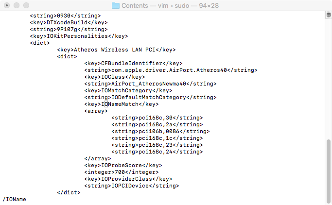
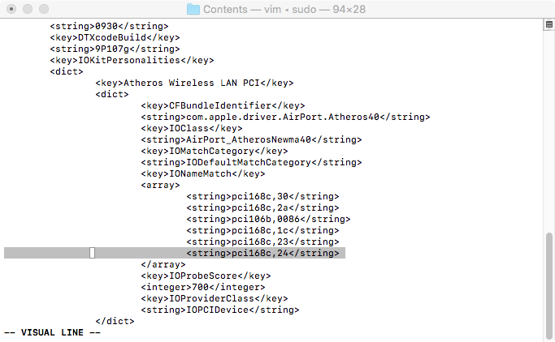
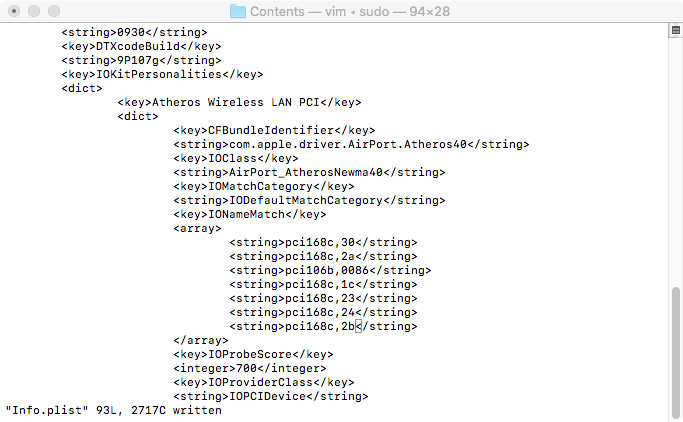
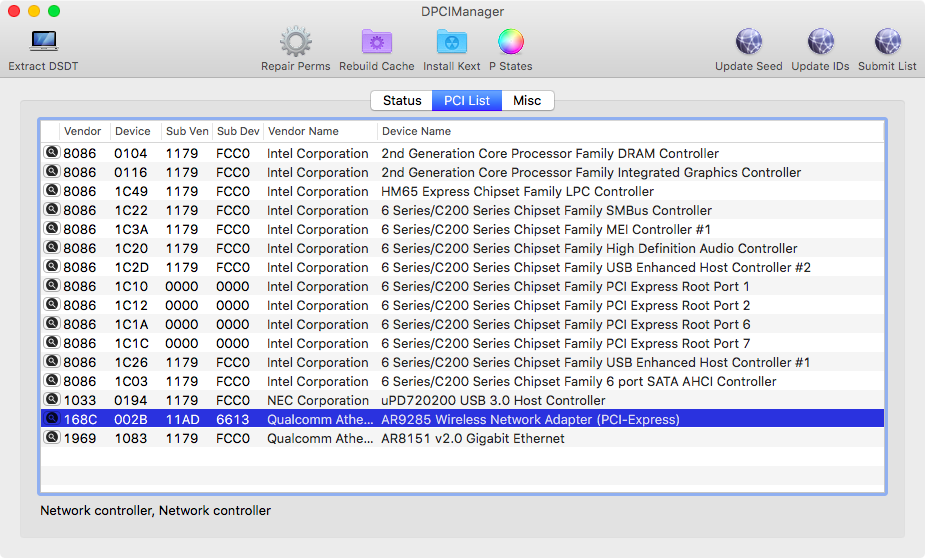

# Fixing Atheros AR9285 on any macOS version

-   Go to S/L/E or /System/Library/Extensions of your mac with command :

    -   `cd /System/Library/Extensions`

-   Go to macOS Atheros Networking kext on IO8011Family.kext with command :

    -   `cd IO8011Family.kext/Contents/PlugIns/AirPortAtheros40.kext/Contents`

-   Modify the Info.plist to match Device ID with your Hardware with command :
    -   `sudo vim Info.plist`
    -   Search IOName by pressing `/IOName`
        -   
    -   Enter vim INSERT mode, press i
    -   Move down and find Device id string name and block it, as you can see here
        -   
    -   Copy and paste that line and match your Hardware Device ID, you can see with DPCIManager
        -   
        -   
    -   Rebuild kextcache with KextUtility
    -   Reboot and, Cheers
